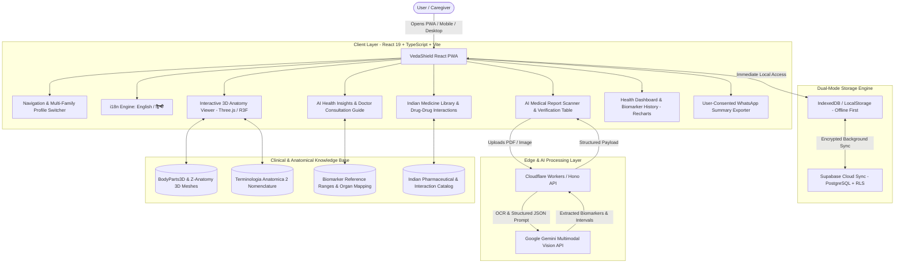
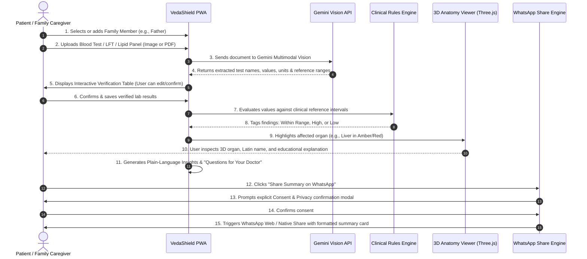

# VedaShield AI · System Architecture & Flow Blueprint

This document specifies the end-to-end architecture, component hierarchy, data flows, and security boundaries of the **VedaShield AI** platform.

---

## 🏛️ System Architecture Overview

---

## 🔄 End-to-End User Flow

---

## 🫀 3D Anatomy & Biomarker Mapping Architecture

The 3D Anatomy module connects laboratory findings directly to their physiological counterparts:

| Organ System | 3D Asset | Associated Lab Biomarkers | Clinical Focus |
|---|---|---|---|
| **Heart** | `heart.glb` | Total Cholesterol, LDL, HDL, Triglycerides, Troponin | Cardiovascular health & lipid profile |
| **Brain** | `brain.glb` | Sodium, Potassium, Vitamin B12, Calcium | Neurological function & electrolyte balance |
| **Lungs** | `lungs.glb` | Hemoglobin, RBC Count, Oxygen Saturation, ESR | Respiratory gas exchange & oxygenation |
| **Liver** | `liver.glb` | SGPT (ALT), SGOT (AST), Bilirubin, Alkaline Phosphatase | Hepatic metabolism, enzymes & detoxification |
| **Kidneys** | `kidneys.glb` | Serum Creatinine, Blood Urea Nitrogen, eGFR, Uric Acid | Renal clearance & fluid balance |
| **Pancreas** | `pancreas.glb` | Fasting Blood Glucose, HbA1c, Post-Prandial Glucose, Amylase | Endocrine regulation & glucose metabolism |
| **Stomach** | `stomach.glb` | Helicobacter pylori, Gastric Acidity, Pepsinogen | Gastric digestion & mucosal integrity |
| **Intestines** | `intestines.glb` | ESR, C-Reactive Protein (CRP), Platelet Count | Nutrient absorption & systemic inflammation |

---

## 🛡️ Security, Privacy & Compliance Architecture

1. **Zero-Knowledge Offline Mode**:
   - Users can operate VedaShield in Guest mode without creating an account or transmitting health data over the network.
   - All records are stored locally in IndexedDB / LocalStorage.

2. **Supabase Cloud Security**:
   - Multi-tenant data segregation enforced using PostgreSQL **Row Level Security (RLS)**.
   - Every read and write query is restricted to `auth.uid() = user_id`.
   - Medical reports and private attachments are protected in isolated storage buckets.

3. **WhatsApp Consent Enforcement**:
   - No medical data is sent via WhatsApp without the user reviewing the summary and checking the explicit consent confirmation dialog.

4. **Medical Guardrails**:
   - The platform strictly enforces educational guidance.
   - Autonomous diagnosis, prescription changes, and dosage recommendations are permanently barred by design.
